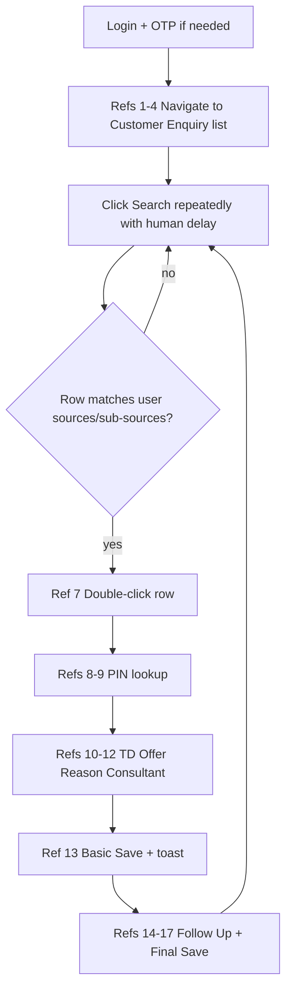

# Enquiry transfer automation

Single source of truth for the **enquiry_transfer** operation in GDMS (visible Chromium only). Other operations (`follow_up`, `exchange`, `test_drive`) exist in code but are **disabled** in the dashboard until implemented separately.

## Reference images

Screenshots live in `apps/web/public/system-reference-images/`. Code constants: `GDMS_REF` in `src/gdms-enquiry-nav-steps.ts`.

| Ref | File | What you should see / do |
|-----|------|---------------------------|
| 1 | `1.jpeg` | GDMS dashboard after login |
| 2 | `2.jpeg` | Left sidebar (car, wrench, user icons) |
| 3 | `3.jpeg` | Car → **Customer Enquiry Mgt** → **Customer Enquiry** |
| 4 | `4.jpeg` | Sales Customer Enquiry list (filters + grid) |
| 6 | `6.jpeg` | Search results (0 to many rows) |
| 7 | `7.jpeg` | **SALES CUSTOMER ENQUIRY INFO** modal (Basic Info tab) |
| 8 | `8.jpeg` | PIN lookup popup — type PIN in **PIN Code** field → **Search** |
| 9 | `9.jpeg` | PIN results — single-click one post office row → **Add Selected** |
| 10 | `10.jpeg` | Back on modal — **TD Offer** → **No** |
| 11 | `11.jpeg` | **Reason for NO** dropdown open — pick any option |
| 12 | `12.jpeg` | **Sales Consultant** — pick next person in rotation |
| 13 | `13.jpeg` | Basic Info filled — click **Save** (`#btnBasicSave`) until success toast |
| 14 | `14.jpeg` | **Follow Up** tab |
| 15 | `15.jpeg` | Next Follow Up Type → **Phone** |
| 16 | `16.jpeg` | *Verification → **Y** |
| 17 | `17.jpeg` | Next Follow Up Time → calendar → **9:30 PM** (date per IST rule below) |

## Flow overview

## Pre-transfer (list)

1. After login, open **Sales Customer Enquiry** (car icon path in refs 2–4).
2. Click the page **Search** button (`#btnSearch` on the list — not the global header search).
3. Do **not** filter Enquiry Source in the UI; match rows in code against the sources/sub-sources the user chose when starting the run.
4. If no matching row: wait (`GDMS_SEARCH_INTERVAL_*`), click Search again, repeat until Stop or a match.
5. **Useful enquiry** = row’s Enquiry Source and Sub Source are in the run’s allowed sets (Digital/CRM sub-lists from dashboard).

## Per-enquiry transfer

### Open modal (ref 7)

- **Double-click** the matching grid row (not Allocate).
- Modal title: **SALES CUSTOMER ENQUIRY INFO**.

### PIN (refs 8–9)

- On Basic Info, click the **magnifier** beside disabled `input#pin` (do not type in main PIN until after Add Selected).
- Target `#pinCodeSearchPopup` inside the enquiry modal iframe.
- In the popup iframe, enter one random PIN from: `800001`, `800006`, `800020`, `800026`.
- Type only in the **PIN Code** filter column (not Post Office Name). Automation enables **input bypass** so keyboard entry is not blocked by `GDMS_BLOCK_USER_INPUT`.
- If the filter is empty, typing + **Search** always run (empty result grid does not skip entry).
- Single-click one result row, then **Add Selected**.
- Popup closes; main form PIN/address fills.
- Automation then waits for the **enquiry Basic Info** surface (TD Offer visible, PIN search popup closed) — not the empty PIN filter screen.

### Basic Info (refs 10–12)

- Stay on the **same** enquiry modal; do not interact with the list until Save + Follow Up complete.
- **Basic Info** tab active; dropdowns scoped to the enquiry form iframe (no page-wide “No” clicks).

- **TD Offer** → **No** (enables Reason for NO).
- **Reason for NO** → random option from the list.
- **Sales Consultant** → next name in dealer rotation (see below).
- **Save** on Basic Info (`#btnBasicSave`) — retry until top/bottom success toast (`successfully reflected`).

### Follow Up (refs 14–17)

- Open **Follow Up** tab.
- **Follow Up Remarks**: `Call Back...`
- **Next Follow Up Type**: **Phone**
- ***Verification**: **Y**
- **Next Follow Up Time**: calendar icon → date per IST rule → time **9:30 PM**
- **Enquiry Type**: **Cold**
- **Final Save** (top right) until success toast.

### After one enquiry

- Modal should close; return to list and resume Search polling for the next match.

## Sales consultant rotation

Round-robin uses **active Sales Consultants under the Team Leader** who owns the run:

- Run started by a **TL** → that TL’s SCs (`reportsToUserId` = TL id).
- Run started by an **SC** → their TL’s SC list (same team).
- Labels: `displayName` if set, else `username` (must match GDMS dropdown text).
- Redis key: `gdms:tl:{teamLeaderUserId}:consultant_rotation` (per TL, not per dealer).
- Order: stable sort by display name / username.

Implementation: `src/consultant-rotation.ts`.

## Next Follow Up Time (IST)

| Current time (Asia/Kolkata) | Calendar date | Time |
|----------------------------|---------------|------|
| 12:00 AM – 1:59 PM | Same day | 9:30 PM |
| 2:00 PM – 11:59 PM | Next day | 9:30 PM |

Code: `nextFollowUpDateIst()` in `src/enquiry-transfer.ts` (`hour >= 14` → +1 calendar day).

## Human pacing (anti-bot)

Configure in `apps/automation-service/.env`:

| Variable | Purpose |
|----------|---------|
| `GDMS_MICRO_DELAY_MIN_MS` / `MAX` | Jitter after hover |
| `GDMS_ACTION_DELAY_MIN_MS` / `MAX` | Pause between UI actions |
| `GDMS_SEARCH_INTERVAL_MIN_MS` / `MAX` | Pause between list Search clicks |
| `GDMS_SAVE_RETRY_INTERVAL_MS` | Wait between Save attempts |
| `GDMS_SAVE_MAX_ATTEMPTS` | Max Save clicks before PAUSED_USER |

Defaults are in `.env.example`. Do not lower delays when using real credentials.

## Requirements

- `PLAYWRIGHT_HEADED=true` — visible browser only for enquiry transfer.
- `SESSIONS_DIR` — Playwright profiles per dealer (`data/sessions/{dealerId}`).
- `last-active-run.json` under `SESSIONS_DIR` — last run/dealer for resume without re-OTP.

## Resume vs retry

| Situation | Action |
|-----------|--------|
| Browser still open, same run, automation-service still has session | Live session → **Continue transfer** → `retry-transfer` |
| Browser closed or automation-service restarted | Dashboard / Live session → **Resume saved session** → reopens profile, skips OTP if cookies valid |
| Stuck on a step | Fix GDMS manually, then **Continue transfer** or **Resume** |

API: `POST /v1/workflow-runs/:id/retry-transfer` (active session), `POST /v1/workflow-runs/:id/resume-session` (reopen profile).

## Code map

| Area | File |
|------|------|
| Main flow | `src/enquiry-transfer.ts` — `runEnquiryTransfer`, `processOneTransfer` |
| PIN + Basic Info + Follow Up | same file — `fillPinAndAdd`, `fillBasicInfoAfterPin`, `completeFollowUpTab` |
| Navigation / dashboard | `src/gdms-session-watch.ts` |
| Consultant rotation | `src/consultant-rotation.ts` |
| Delays | `src/human-delay.ts` |
| Runner / browser | `src/runner.ts` |
| Retry / resume | `src/retry-enquiry-transfer.ts`, `src/resume-enquiry-transfer.ts` |
| Enabled operations | `packages/shared/src/automation-options.ts` |
| Live log hints | `apps/web/src/lib/automation-log-present.ts` |

## Live session logs

Watch for sequences like:

1. `PIN already set` or PIN popup row / Add Selected
2. `TD Offer set to No`
3. `Reason for NO selected: …`
4. `Assigning sales consultant: …`
5. `Save succeeded`
6. `Follow Up tab` → `Save succeeded`

Events are published on Redis channel `gdms:workflow_events` (`LOG_LINE`).
