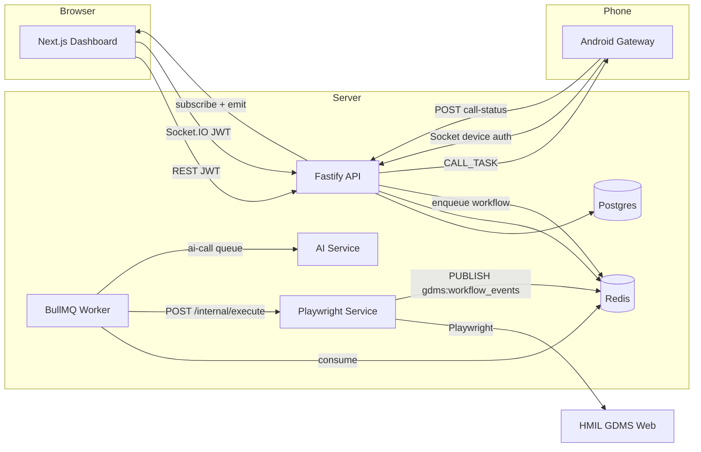

# GDMS Automation SaaS — Project Context

> **Purpose:** Multi-tenant SaaS for Hyundai GDMS (dealer CRM) — browser automation, leads, Android click-to-call gateway, AI voice stub.  
> **Production URL (README):** https://bot.edunexservices.in  
> **GDMS target:** `https://ndms.hmil.net/cmm/cmmi/selectLoginMain.dms` (HMIL Hyundai NDMS)

Use this document as the single source of context when planning improvements. Keep it updated when architecture or contracts change.

---

## 1. Executive summary

**pnpm + Turborepo monorepo** with:

| Layer | Tech | Role |
|--------|------|------|
| Dashboard | Next.js (`apps/web`) | Dealer login, START automation, OTP, live session, leads |
| API | Fastify + Socket.IO (`apps/api`) | REST, JWT, BullMQ enqueue, realtime fanout |
| Worker | BullMQ (`apps/worker`) | Consumes jobs → HTTP dispatch to automation-service |
| Automation | Playwright (`apps/automation-service`) | GDMS login, enquiry transfer, follow-up skip |
| AI | Fastify stub (`apps/ai-service`) | Ollama classify / call pipeline (MVP) |
| Android | Kotlin (`apps/android/gateway`) | Device pairing, `CALL_TASK`, call status |
| Data | Postgres + Prisma, Redis | Tenants, runs, OTP, pub/sub |

**MVP focus:** Headed Chromium automation for **enquiry transfer** and scheduled **follow up skip**. Other operations (`follow_up`, `exchange`, `test_drive`) exist in code but are **disabled** in the UI and worker validation.

---

## 2. Repository layout

```
/opt/automation/
├── apps/
│   ├── api/                 # Fastify API + Socket.IO
│   ├── web/                 # Next.js dashboard
│   ├── worker/              # BullMQ consumers
│   ├── automation-service/  # Playwright GDMS automation
│   ├── ai-service/          # Ollama / call stub
│   ├── android/gateway/     # Kotlin Socket.IO gateway
│   └── android-gateway-docs/
├── packages/
│   ├── database/            # Prisma schema + client
│   ├── shared/              # Types, socket events, env schemas
│   ├── auth/                # JWT, RBAC, AES credential crypto
│   ├── workflow-engine/     # Workflow step definitions + classify
│   └── logger/              # Pino wrapper
├── deploy/caddy/            # Production reverse proxy
├── scripts/                 # Option B (KVM + PC worker) helpers
├── docs/                    # Project documentation (this file)
├── docker-compose.yml
├── docker-compose.prod.yml
└── docker-compose.tunnel.yml
```

**Workspace packages:** `@gdms/api`, `web`, `@gdms/worker`, `@gdms/automation-service`, `@gdms/ai-service`, `@gdms/database`, `@gdms/shared`, `@gdms/auth`, `@gdms/workflow-engine`, `@gdms/logger`.

**Root scripts:**

| Script | Action |
|--------|--------|
| `pnpm install` | Install deps |
| `pnpm build` | Prisma generate + turbo build |
| `pnpm dev` | All apps dev (parallel) |
| `pnpm dev:local-agent` | Worker + automation only |
| `pnpm docker:up` | Postgres + Redis containers |
| `pnpm db:push` | Apply Prisma schema |
| `pnpm db:studio` | Prisma Studio |

**CI:** `.github/workflows/ci.yml` — `pnpm turbo run build` on push/PR to `main`/`master`.

---

## 3. High-level architecture



### End-to-end: Dashboard START → GDMS

1. User selects dealer, operation, and sources on **Dashboard** → `POST /v1/workflow-runs`.
2. API creates `WorkflowRun` (`PENDING`), enqueues BullMQ job on `workflow` queue (`jobId = runId`).
3. **Worker** picks job → decrypts `GdmsAccount` → `POST automation-service/internal/execute` (202, async).
4. **Automation-service** runs `runWorkflow()`:
   - Launches persistent Chromium profile (per dealer + operation).
   - Executes login workflow (credentials → Send OTP → wait for dashboard OTP via Redis → final login).
   - Runs operation logic (`enquiry_transfer` or `follow_up_skip`; preset workflow steps are mostly placeholders).
5. Progress events: automation **Redis PUBLISH** on `gdms:workflow_events` → API subscriber → **Socket.IO** to `run:{id}` and `dealer:{id}` rooms.
6. **Live session** page shows logs, screenshots, OTP modal, pause/resume/stop, optional noVNC paths.

---

## 4. Data model (Prisma)

**Schema:** `packages/database/prisma/schema.prisma`

| Model | Purpose |
|--------|---------|
| `Dealer` | Tenant |
| `User` | `SUPER_ADMIN` / `DEALER` / `USER`; optional `dealerId` |
| `GdmsAccount` | AES-encrypted GDMS username/password per dealer |
| `DealerAutomationSettings` | `followUpSkipEnabled`, `followUpSkipStartTime` (IST `HH:mm`) |
| `DealerWorkflow` | Optional JSON workflow override per dealer/name/version |
| `WorkflowRun` | Lifecycle, `runParams`, `browserSessionKey`, errors |
| `Inquiry` / `InquiryLog` | Leads from GDMS ingest / classification |
| `AiCall` / `CallLog` | AI + Android call phases |
| `AndroidDevice` | `deviceId`, pairing hash, `socketTokenHash` |
| `VoiceProfile` | Voice clone artifacts (future) |

**WorkflowRunStatus:** `PENDING`, `RUNNING`, `PAUSED_OTP`, `PAUSED_USER`, `COMPLETED`, `FAILED`, `STOPPED`.

**LeadCategory:** `HOT`, `WARM`, `FAKE`, `NEED_CALL`.

**Migrations (examples):**

- `20260214120000_phase2_android_socket_token`
- `20260215103000_phase3_call_status`
- `20260515120000_workflow_run_params`
- `20260519140000_dealer_automation_settings`

---

## 5. Shared contracts (`@gdms/shared`)

### Automation operations

Defined in `packages/shared/src/automation-options.ts`:

| Constant | Values |
|----------|--------|
| `AUTOMATION_OPERATIONS` | `enquiry_transfer`, `follow_up`, `follow_up_skip`, `exchange`, `test_drive` |
| `ENABLED_AUTOMATION_OPERATIONS` | `enquiry_transfer`, `follow_up_skip` |
| `DASHBOARD_MANUAL_OPERATIONS` | `enquiry_transfer` only |

`follow_up_skip` can also start via **Settings** scheduler or **run-now** API.

**Sources:** Walkin, Field Generation, Digital, CRM, Referral, Incoming Call, GeM.

**Sub-sources (when parent selected):**

- **Digital:** HMIL Social Media, Website, Hyper Local
- **CRM:** HMIL Call Centre, Chatbot

### Socket.IO (`packages/shared/src/socket-events.ts`)

| Event | Direction | Meaning |
|--------|-----------|---------|
| `OTP_REQUIRED` | → dashboard | GDMS OTP needed |
| `WORKFLOW_STARTED` | → dashboard | Run began |
| `STEP_COMPLETED` | → dashboard | Step label progress |
| `WORKFLOW_COMPLETED` | → dashboard | Run finished (e.g. login done) |
| `WORKFLOW_FAILED` | → dashboard | Error |
| `WORKFLOW_PAUSED_USER` | → dashboard | Save retries exhausted; manual CRM |
| `LOG_LINE` | → dashboard | Live log line |
| `SCREENSHOT_FRAME` | → dashboard | Base64 preview frame |
| `LEAD_CLASSIFIED` | → dashboard | Inquiry category updated |
| `GDMS_SESSION_REDIRECTED` | → dashboard | Idle timeout / logout |
| `CONTROL_ACK` | → dashboard | pause/resume/stop ack |
| `CALL_TASK` | → Android `device:{id}` | Dial task after inquiry call |
| `CALL_STATUS_UPDATE` | → `dealer:{id}` | Telephony phases |
| `VOICE_SESSION_SIGNAL` | contract only | WebRTC prep (no SFU relay yet) |
| `ANDROID_HEARTBEAT` | device | Liveness |

**Rooms:** `run:{runId}`, `dealer:{dealerId}`, `device:{deviceId}`.

**Redis:**

- Channel: `gdms:workflow_events` (automation → API → Socket.IO)
- OTP: `run:{runId}:otp`, pub/sub `run:{runId}:otp_ready`
- Log buffer: `run:{runId}:log_buffer` (API LRANGE for replay)
- Control: `run:{runId}:pause`, `run:{runId}:stop`

---

## 6. Applications

### 6.1 API (`apps/api`)

**Entry:** `src/server.ts`

- Registers REST routes, `startFollowUpSkipScheduler()`, attaches Socket.IO to HTTP server.
- BullMQ queues: `workflow`, `ai-call`, `gdms-sync`.

**Important modules:**

| Module | Role |
|--------|------|
| `socket.ts` | JWT + Android device auth; Redis workflow subscriber |
| `routes/workflow-runs.ts` | Start/stop/OTP/control/logs/VNC view |
| `lib/follow-up-skip-scheduler.ts` | IST daily enqueue per dealer settings |
| `lib/stale-workflow-run.ts` | Heal stuck PENDING runs |
| `lib/ensure-workflow-job.ts` | Bull job requeue / purge |
| `lib/trigger-enquiry-resume.ts` | Resume after pause |

**REST routes (summary):**

| Method | Path | Notes |
|--------|------|--------|
| POST | `/v1/auth/register`, `/login`, `/refresh`, `/logout` | Auth |
| GET | `/v1/me` | Current user |
| GET/POST | `/v1/dealers`, `/v1/dealers/:id` | Tenants |
| GET/POST | `/v1/users` | User management (RBAC) |
| PUT/GET | `/v1/gdms-account`, `/v1/gdms-accounts` | Encrypted CRM creds |
| PUT | `/v1/gdms/login-token` | Cookie bootstrap token |
| GET/POST | `/v1/workflows` | Workflow definitions |
| POST/GET | `/v1/workflow-runs`, `/in-flight`, control, OTP, logs | Automation |
| GET | `/v1/gdms-browser-view` | noVNC workspace URLs |
| GET | `/v1/inquiries` | Leads (SUPER_ADMIN: all dealers) |
| GET/PUT/POST | `/v1/dealers/:id/automation-settings`, `run-now` | Follow-up skip schedule |
| POST | `/v1/android/pair`, `claim`, `call-status`, `rotate-socket-token` | Gateway |
| GET | `/v1/integrations/webrtc` | ICE servers (Phase 6) |
| GET | `/health` | API + workflow subscriber status |

### 6.2 Worker (`apps/worker`)

**Entry:** `src/index.ts`

- `workflow` queue worker, **concurrency: 1**.
- Decrypts GDMS credentials, builds `defaultLoginWorkflow` + operation workflow, `POST /internal/execute`.
- On failure: transient 502/503/504 may keep run `PENDING` for Bull retry; else `FAILED`.
- `ai-call` worker dispatches to `ai-service`.

### 6.3 Automation service (`apps/automation-service`)

**Entry:** `src/server.ts` — internal routes protected by `x-internal-secret`.

| Module | Role |
|--------|------|
| `runner.ts` | Main executor, OTP, Redis publish, step runner |
| `enquiry-transfer.ts` | Full enquiry CRM flow |
| `follow-up-skip.ts` | Today's Follow Up automation |
| `resume-*.ts` / `retry-*.ts` | Recovery after `PAUSED_USER` or retry |
| `browser-profile.ts` | Persistent Chromium contexts |
| `active-sessions.ts` | Per-run session registry |
| `gdms-session-watch.ts` | Idle logout, session redirect events |
| `preview-stream.ts` | Screenshot streaming |
| `gdms-vnc-display.ts` | VNC workspaces (6080 / 6081) |
| `ingest-inquiries.ts` | Sync inquiries from list page |
| `consultant-rotation.ts` | Sales consultant round-robin |

**Internal HTTP:**

- `POST /internal/execute`
- `POST /internal/resume-enquiry-transfer`
- `POST /internal/resume-follow-up-skip`
- `POST /internal/retry-enquiry-transfer`
- `POST /internal/retry-follow-up-skip`
- OTP notify endpoint (see `server.ts`)

**Browser profiles:**

- Enquiry transfer: `{dealerId}`
- Follow up skip: `{dealerId}-follow-up-skip` (can run in parallel with enquiry transfer)

**Documentation:**

- [ENQUIRY_TRANSFER.md](../apps/automation-service/docs/ENQUIRY_TRANSFER.md)
- [FOLLOW_UP_SKIP.md](../apps/automation-service/docs/FOLLOW_UP_SKIP.md)

### 6.4 Web (`apps/web`)

| Route | Purpose |
|-------|---------|
| `/login` | Email + password sign-in (dev quick sign-in optional) |
| `/register` | First-time Super Admin setup (only when no users exist) |
| `/dashboard` | Start automation, sources, session resume, GDMS token |
| `/live-session` | Realtime logs, preview/VNC, pause/stop/retry |
| `/leads` | Inquiries table + realtime classification |
| `/settings` | GDMS credentials, follow-up skip schedule |
| `/users` | User management |

**State (Zustand):** `auth-store`, `live-store`, `automation-session-store`, `leads-store`.

**Hooks:** `use-realtime-socket`, `use-heal-automation-on-refresh`.

### 6.5 AI service (`apps/ai-service`)

- Ollama integration (`ollama.ts`, `pipeline.ts`).
- `POST /internal/call/start` — triggered from `ai-call` queue.
- Lead classification via `workflow-engine` filters.

### 6.6 Android gateway (`apps/android/gateway`)

- Pairing flow: dashboard `pair` → device `claim` → `socketToken` (shown once).
- `GatewayService.kt`: Socket.IO, `CALL_TASK`, telephony → `POST /v1/android/call-status`.
- `GatewayCredentials.kt`: EncryptedSharedPreferences (v0.4+).
- Biometric before start saved token (v0.5+).

**Docs:** `apps/android-gateway-docs/PAIRING.md`, `PHASE3_AUDIO.md`.

---

## 7. Workflow engine (`@gdms/workflow-engine`)

**Presets:** `packages/workflow-engine/src/gdms-presets.ts`

| Preset | Use |
|--------|-----|
| `defaultLoginWorkflow` | OTP login steps |
| `enquiryTransferWorkflow` | Empty steps — logic in `enquiry-transfer.ts` |
| `followUpSkipWorkflow` | Empty steps — logic in `follow-up-skip.ts` |
| `inquiryFetchWorkflow` | Open list + wait rows |
| `operationStubWorkflow` | Disabled operations |

**Step types (runner):** `navigate`, `fill`, `click`, `wait_for_otp`, `wait_for_gdms_dashboard`, `assert_no_gdms_login_error`, `wait_selector`, etc.

**Selectors:** Environment variables `GDMS_SEL_*` or Playwright shortcuts (`pw:btn|Send OTP`, `pw:ph|User ID`).

---

## 8. Security & RBAC (`@gdms/auth`)

> **Target 4-level hierarchy** (Super Admin → Admin → TL → SC, automation only for TL/SC): see **[ROLE_HIERARCHY.md](./ROLE_HIERARCHY.md)**.

| Role (current code) | Capabilities today |
|------|----------------|
| `SUPER_ADMIN` | All dealers; joins every `dealer:{id}` socket room; can also start workflows (target: platform-only, no automation) |
| `DEALER` | Own dealer; manage users, GDMS secrets, start workflows (target: rename to dealer **Admin**, no automation) |
| `USER` | Start workflows for own dealer (target: **TL** or **SC**) |

- GDMS passwords: AES-256-GCM with `CREDENTIALS_MASTER_KEY` (32-byte base64).
- Service-to-service: `AUTOMATION_INTERNAL_SECRET`, `AI_INTERNAL_SECRET` via `x-internal-secret`.
- Android socket: bcrypt `socketTokenHash`; plain token only in claim response.

---

## 9. Deployment

### Local / full Docker

```bash
docker compose up --build
```

Host ports: Postgres **54322**, Redis **6380**, API **4000**, Web **3000**.

Node on host must use those ports in each app `.env`.

### Production (KVM + Caddy)

`docker compose -f docker-compose.yml -f docker-compose.prod.yml up`

- **Caddy** (`deploy/caddy/sites.d/automation.caddy`):
  - `bot.edunexservices.in` → `automation-web:3000`
  - `/socket.io*` → `automation-api:4000`
  - `/gdms-browser/*` → playwright **6080**
  - `/gdms-browser-2/*` → playwright **6081**

### Option B — KVM API + PC worker (headed browser on desktop)

1. KVM runs: postgres, redis, api, web, ai — **not** worker/automation containers.
2. PC: SSH tunnel to KVM Redis/Postgres (`scripts/ssh-tunnel-kvm.ps1`).
3. PC runs worker + automation with matching secrets from KVM `.env`.
4. See README **Option B** section and `apps/worker/.env.option-b.example`.

**Critical:** Only one consumer set for workflow jobs — do not run KVM worker while PC worker is active.

---

## 10. Environment variables

| Service | Required / notable |
|---------|-------------------|
| **API** | `DATABASE_URL`, `REDIS_URL`, `JWT_SECRET` (32+), `REFRESH_TOKEN_SECRET`, `CREDENTIALS_MASTER_KEY`, `CORS_ORIGIN`, `AUTOMATION_INTERNAL_SECRET`, optional `VOICE_BRIDGE_ENABLED`, `WEBRTC_*` |
| **Worker** | Same DB/Redis/key, `AUTOMATION_SERVICE_URL`, `GDMS_BASE_URL`, `AUTOMATION_INTERNAL_SECRET` |
| **Automation** | `GDMS_BASE_URL`, `SESSIONS_DIR`, `AUTOMATION_INTERNAL_SECRET`, `PLAYWRIGHT_HEADED`, `GDMS_PREVIEW_STREAM`, `GDMS_REMOTE_VIEW`, VNC password/size |
| **Web** | `NEXT_PUBLIC_API_URL`, `NEXT_PUBLIC_SOCKET_URL`, `API_UPSTREAM_URL` |
| **AI** | `OLLAMA_HOST`, `OLLAMA_MODEL`, `AI_INTERNAL_SECRET` |

Generate credential key:

```bash
node -e "console.log(require('crypto').randomBytes(32).toString('base64'))"
```

---

## 11. Product phases (from README)

| Phase | Status | Highlights |
|-------|--------|------------|
| 2 | Done | Android `socketToken`, `CALL_TASK` via Socket.IO |
| 3 | Done | Call status → `CallLog`, `CALL_STATUS_UPDATE` |
| 4 | Done | SUPER_ADMIN multi-dealer realtime + leads |
| 5 | Done | Encrypted Android prefs, `VOICE_SESSION_SIGNAL` contract |
| 6 | Done | `GET /v1/integrations/webrtc`, biometric, network config |
| 7 | Planned | SFU (mediasoup/LiveKit), PSTN recording |

---

## 12. Known limitations & improvement backlog

Prioritize from this list when planning work:

1. **Disabled operations** — `follow_up`, `exchange`, `test_drive` are stubs; UI and validation block them.
2. **SUPER_ADMIN socket rooms** — new dealer rooms only after reconnect (refresh/re-login).
3. **Android token rotate** — app does not auto-update EncryptedSharedPreferences; re-pair or clear + pair.
4. **Voice bridge** — `VOICE_BRIDGE_ENABLED` is logging/contract only; no SFU for `VOICE_SESSION_SIGNAL`.
5. **AI latency on CPU KVM** — tune Ollama model size or add GPU for XTTS/RVC paths.
6. **GDMS DOM coupling** — override via `GDMS_SEL_*`; reference UI images under `apps/web/public/system-reference-images/`.
7. **Worker concurrency** — single concurrent workflow per worker process; scaling needs session isolation rules.
8. **Option B operations** — duplicate job consumers if KVM worker/automation not stopped; port clash with local `pnpm docker:up`.
9. **Production auth** — disable `AUTH_DEV_OPEN_LOGIN` in hardened deployments.
10. **Follow-up skip scheduler** — Redis key per dealer/day/time; changing IST time same day may fire again.
11. **Enquiry transfer pause** — `PAUSED_USER` when save retries fail; needs manual CRM + resume endpoints.
12. **CI** — build/typecheck only; no Playwright e2e in pipeline.

---

## 13. Key files map

| Topic | Path |
|--------|------|
| Root overview | `README.md` |
| Enquiry transfer spec | `apps/automation-service/docs/ENQUIRY_TRANSFER.md` |
| Follow up skip spec | `apps/automation-service/docs/FOLLOW_UP_SKIP.md` |
| Run orchestration | `apps/automation-service/src/runner.ts` |
| Job dispatch | `apps/worker/src/index.ts` |
| Start automation API | `apps/api/src/routes/workflow-runs.ts` |
| Socket fanout | `apps/api/src/socket.ts` |
| Dashboard UI | `apps/web/src/app/(dashboard)/dashboard/page.tsx` |
| Live session UI | `apps/web/src/app/(dashboard)/live-session/page.tsx` |
| Prisma schema | `packages/database/prisma/schema.prisma` |
| Automation options | `packages/shared/src/automation-options.ts` |
| Socket events | `packages/shared/src/socket-events.ts` |
| Login workflow preset | `packages/workflow-engine/src/gdms-presets.ts` |
| Caddy production | `deploy/caddy/sites.d/automation.caddy` |

---

## 14. Quick start (developer)

1. Node 20+, pnpm 9, Docker (Postgres + Redis).
2. `pnpm install`
3. Build packages: `@gdms/shared`, `@gdms/auth`, `@gdms/logger`, `@gdms/workflow-engine`; `prisma generate`.
4. `pnpm docker:up` → `pnpm db:push`
5. Dev terminals: `api`, `worker`, `automation-service`, `ai-service`, `web` (see README).
6. Open http://localhost:3000 — register first user, create dealer, save GDMS in Settings, START from Dashboard.

---

## 15. Related docs to add (optional)

| File | Use |
|------|-----|
| `docs/IMPROVEMENT_BACKLOG.md` | Ticket list derived from §12 |
| `docs/RUNBOOK_OPTION_B.md` | KVM + PC ops checklist |
| `docs/API_CONTRACT.md` | Full OpenAPI-style route reference |

---

*Last updated: 2026-06-04. Update this file when adding services, routes, or deployment modes.*
