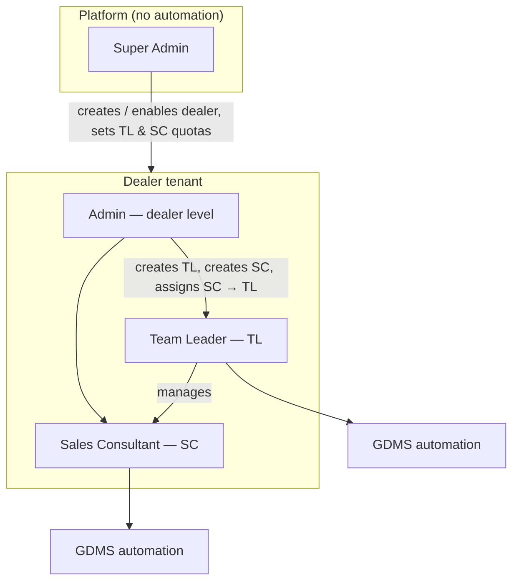

# Role hierarchy — target product model

Yeh document **aapki desired hierarchy** ko define karta hai aur **abhi codebase mein kya hai** usse compare karta hai. Implementation ke liye source of truth yahi rakho.

---

## 1. Target hierarchy (4 levels)



| # | Role | Scope | Automation (GDMS START, Live session, OTP)? | Primary duties |
|---|------|--------|---------------------------------------------|----------------|
| 1 | **Super Admin** | Poora platform | **Nahi** | Naye **dealer** account add karna; dealer **active / disable**; platform par decide karna **ek dealer ke liye kitne TL aur kitne SC** allowed hain; dealer-level limits enforce karna. GDMS credentials / enquiry transfer / follow-up skip — in sab se door. |
| 2 | **Admin** | Ek dealer | **Nahi** | Us dealer ke andar **TL accounts** banana; **SC accounts** banana; har **SC ko kisi TL se attach** karna (reporting line). Users activate/deactivate (dealer scope). Automation UI nahi. |
| 3 | **Team Leader (TL)** | Ek dealer | **Haan** | Wahi kaam jo aaj “operational” user karta hai: Dashboard se automation START, sources/sub-sources, Live session, OTP, pause/stop, leads dekhna (apni team context mein). |
| 4 | **Sales Consultant (SC)** | Ek dealer | **Haan** | TL jaisa automation surface (ya SC-specific subset — product decision); typically apne enquiries / runs; TL ke under reporting. |

**Important:** Super Admin aur Admin dono **automation se koi matlab nahi** — sirf org / account governance.

---

## 2. Reporting & data relationships (target)

```
Super Admin
    └── Dealer (active: boolean, maxTeamLeaders: int, maxSalesConsultants: int)
            └── Admin users (1..n per dealer — product rule TBD)
            └── Team Leader users
                    └── Sales Consultant users (reportsToTeamLeaderId)
```

- Har **TL** aur **SC** ka `dealerId` same hona chahiye.
- **SC → TL** attachment zaroori (ek SC ek TL ke under; reassign Admin karega).
- **Super Admin** sirf dealer meta + quotas; dealer ke andar users create **Admin** karega.

---

## 3. Abhi codebase mein kya hai (MVP)

Prisma enum `UserRole`:

| Code role | Aaj ka behaviour (approx) |
|-----------|---------------------------|
| `SUPER_ADMIN` | Saare dealers list; naya dealer `POST /v1/dealers`; saare users; **leads sab dealers**; socket par **har dealer room**; **automation START bhi kar sakta hai** (`canStartWorkflow`) — target ke khilaf. |
| `DEALER` | Dealer-scoped users create; GDMS settings; **automation START** — naam “Dealer” hai lekin aapke **Admin** se match nahi (Admin ko automation nahi chahiye). |
| `USER` | Dealer-scoped; **automation START** — aaj yeh practical **TL/operator** jaisa treat ho raha hai. |

**Dealer model:** sirf `id`, `name` — **active/disable**, **max TL / max SC** fields **nahi**.

**User model:** `dealerId` optional; **TL parent**, **role subtype**, **active flag** — **nahi**.

**Navigation (sab logged-in roles ko lagbhag same):** Dashboard, Live session, Leads, Settings, Users — koi role-based hide nahi.

---

## 4. Mapping: aapki hierarchy → code (today)

| Aapka role | Abhi kaun sa code role? | Gap |
|------------|-------------------------|-----|
| Super Admin (platform, no automation) | `SUPER_ADMIN` | Automation + GDMS settings + dashboard sab open — **split karna hoga** |
| Admin (dealer, no automation) | `DEALER` (partial) | Name galat; automation + settings abhi allowed |
| Team Leader | `USER` ya `DEALER` (jo login karke START karta hai) | Dedicated `TEAM_LEADER` role nahi; TL↔SC link nahi |
| Sales Consultant | *(explicit role nahi)* | `USER` se alag identify nahi; SC→TL attach nahi |

**“Abhi jo chal raha hai yeh TL level ka chal raha hai”** — sahi observation:

- Enquiry transfer / follow-up skip **kis bhi account se** chal sakta hai jisko `canStartWorkflow` true hai (`SUPER_ADMIN`, `DEALER`, `USER`).
- Dealer choose + sources + START UI **Dashboard** par — yeh **operational (TL/SC) surface** hai.
- Aaj aksar **ek hi dealer user** (often `USER` ya `DEALER`) production mein GDMS run karta hai → effectively **TL-level operator** treat ho raha hai, chahe role enum `USER` ho.

---

## 5. RBAC rules (target — implement karna hai)

### 5.1 Super Admin

| Action | Allowed |
|--------|---------|
| Dealer CRUD, active/disable | Yes |
| Set per-dealer `maxTeamLeaders`, `maxSalesConsultants` | Yes |
| Create dealer Admin (**required** on `POST /v1/dealers` — `admin.username` + `admin.password`) | Yes |
| GDMS credentials, workflow START, Live session | **No** |
| Leads (all dealers) | Optional read-only audit; default **No** |

### 5.2 Admin (dealer)

| Action | Allowed |
|--------|---------|
| Create / disable TL, SC (within quotas) | Yes |
| Assign SC → TL | Yes |
| GDMS account, automation START, Live session | **No** |
| View team users list | Yes |

### 5.3 Team Leader

| Action | Allowed |
|--------|---------|
| Automation START (dealer GDMS already configured by Admin or shared dealer creds) | Yes |
| Live session, OTP, pause/stop, retry | Yes |
| Leads (dealer / team scope — rule TBD) | Yes |
| Create users | No (Admin only) |

### 5.4 Sales Consultant

| Action | Allowed |
|--------|---------|
| Automation (same as TL or restricted ops — product TBD) | Yes |
| Live session, etc. | Yes |
| Create users / assign TL | No |
| See only own runs vs team runs | **Product decision** |

### 5.6 Team type (Digital / Field) — implemented

- **Team Leader** create karte waqt **Digital** ya **Field** choose karein (Dealer Admin).
- **Sales Consultant** ko **kis TL ke under** hai — zaroor select karein.
- **Enquiry transfer** sirf **Digital** team (TL + unke SC).
- **Field** team: follow-up skip / leads; enquiry transfer nahi.
- **Team Leader** apne **SC users khud create** kar sakta hai (`/users` → My team).

### 5.5 Per-user GDMS credentials (implemented)

- Har **TL** aur **SC** ka apna `GdmsAccount` (`userId` unique) — encrypted username/password.
- **TL / SC:** Settings → **GDMS login** — apna khud save karein.
- **Admin:** Settings → team table se kisi bhi TL/SC ke liye creds set kare.
- Automation START / worker run **us user ke** credentials use karta hai (`startedByUserId` on workflow job).
- **Live session** sirf **apna** in-flight run dikhata hai — doosre TL/SC ka run same dealer par bhi nahi dikhega (API + localStorage per user id).
- **GDMS browser (noVNC)** har user ka **alag virtual display + profile** (`gdms-browser-enq-u{N}`) — shared `:99` workspace hata diya.

---

## 6. Suggested Prisma / API changes (implementation backlog)

### Schema (high level)

```prisma
enum UserRole {
  SUPER_ADMIN
  DEALER_ADMIN    // aapka "Admin"
  TEAM_LEADER
  SALES_CONSULTANT
}

model Dealer {
  id                    String
  name                  String
  isActive              Boolean @default(true)
  maxTeamLeaders        Int     @default(5)
  maxSalesConsultants   Int     @default(20)
  // ...
}

model User {
  // ...
  role                  UserRole
  dealerId              String?
  reportsToUserId       String?  // SC → TL; null for TL/Admin
  isActive              Boolean  @default(true)
}
```

Migrate existing:

- `DEALER` → `DEALER_ADMIN`
- `USER` → `TEAM_LEADER` (agar woh hi automation operator hai) ya `SALES_CONSULTANT` (manual mapping)

### `@gdms/auth` rbac.ts

- `canStartWorkflow` → only `TEAM_LEADER`, `SALES_CONSULTANT`
- `canEditGdmsSecrets` → `DEALER_ADMIN` (+ optional `SUPER_ADMIN` never)
- `canManageUsers` → `SUPER_ADMIN` (platform), `DEALER_ADMIN` (dealer users only)
- `canManageDealers` → `SUPER_ADMIN` only

### UI routes by role

| Route | Super Admin | Admin | TL | SC |
|-------|-------------|-------|----|----|
| `/platform/dealers` | Yes | No | No | No |
| `/users` (team) | No | Yes | No | No |
| `/dashboard` (START) | No | No | Yes | Yes |
| `/live-session` | No | No | Yes | Yes |
| `/settings` (GDMS login) | No | Team table | Own creds | Own creds |
| `/leads` | Optional | Optional | Yes | Yes |

---

## 7. Implementation phases (recommended)

| Phase | Deliverable |
|-------|-------------|
| **A** | Prisma roles + `Dealer.isActive`, quotas; migration |
| **B** | RBAC helpers + API guards (workflow-runs, gdms-account, users, dealers) |
| **C** | Super Admin UI: dealer list, active toggle, max TL/SC |
| **D** | Admin UI: create TL/SC, assign SC→TL, enforce quotas |
| **E** | Hide automation nav for Super Admin & Admin; TL/SC only Dashboard + Live + Leads |
| **F** | Optional: per-user `WorkflowRun.startedByUserId` audit; SC scope on inquiries |

---

## 8. Seed accounts (Dealer 1)

Login: **username + password** (not email) at https://bot.edunexservices.in/login

| Username | Password | Role |
|----------|----------|------|
| `super` | `super123` | Super Admin → `/platform/dealers` |
| `admin1` | `admin1` | Dealer Admin → `/users` |
| `1tl1` | `1tl1` | Team Leader → `/dashboard` |
| `1tl2` | `1tl2` | Team Leader |
| `1sc1` | `1sc1` | SC under 1tl1 |
| `1sc2` | `1sc2` | SC under 1tl1 |
| `2sc1` | `2sc1` | SC under 1tl2 |

Re-seed: `DATABASE_URL=... pnpm db:seed`

---

## 9. Quick reference (Hinglish)

1. **Super Admin** = platform boss — dealer on/off, kitne TL/SC allowed — **browser automation kabhi nahi**.
2. **Admin** = dealer ka HR/ops manager — TL banao, SC banao, SC ko TL se jodo — **automation nahi**.
3. **TL** = dealer ka field lead — **GDMS automation yahi chalata hai** (aaj jaisa flow).
4. **SC** = consultant — **automation haan**, TL ke under.

**Aaj:** enum mein sirf 3 role; `USER`/`DEALER` dono automation kar sakte hain → **TL-level flow pehle se chal raha hai**, lekin Super Admin / Admin alag **nahi** bane.

---

*Related: [PROJECT_CONTEXT.md](./PROJECT_CONTEXT.md) — system overview.*
